# air-quality-analysis
Jupyter notebooks and Python code for analyzing air quality (fine particles, PM<sub>2.5</sub>) 

# Table of contents

<a href="#1">1. Basic data visualization</a>  
<a href="#2">2. Correlation of PM<sub>2.5</sub></a>  
  <a href="#2.1">2.1 Correlation of PM<sub>2.5</sub> with time</a>  
    <a href="#2.2.1">2.2. Correlation of PM<sub>2.5</sub> with wind and temperature (data cleaning)</a>  
    <a href="#2.2.2">2.2. Correlation with wind and temperature (analysis)</a>  
  <a href="#2.3">2.3 Correlation with MERRA-2 data</a>  
  <a href="#2.4">2.4 Conversion wind (U,V) component, RH from temperatures </a>  
<a href="#3.1">3.1 Data selection</a>  
<a href="#3.2">3.2 Regression</a>  

<a href="#todo">TODO</a>  
<a href="#tools">Tool and packages</a>  
<a href="#credit">4. Credits</a>  

***PDF version is in PDF folder, likewise HTML's***

<a id="1"></a>
## 1. Basic data visualization
- introduce to basic setup of folder, install `pandas`, `matplotlib`, `seaborn` (using `pip` for Python package), `Anaconda` is a good choice if you are using Windows (or even Mac, Linux). Alternatively, try out [**Google Colaboratory**](https://colab.research.google.com/)
- basic use of those tools (clean, explore, plot, interpret)
- work with a CSV file from [Airnow.gov](https://www.airnow.gov/international/us-embassies-and-consulates/)
- here are some graphs produced from this exercise
  - basic line chart
  <p align="center">
    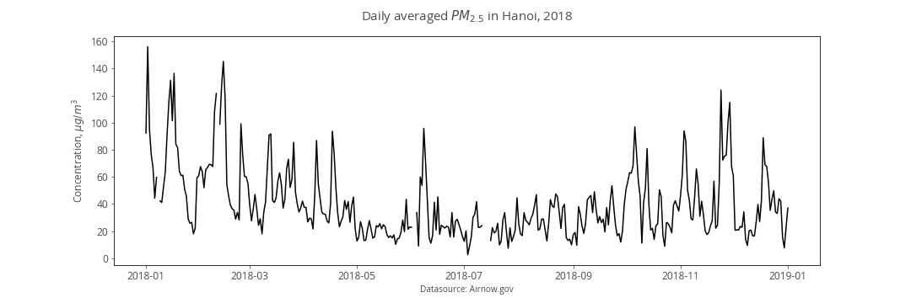
  </p>
  
  - line chart with a band for standard deviation
  <p align="center">
    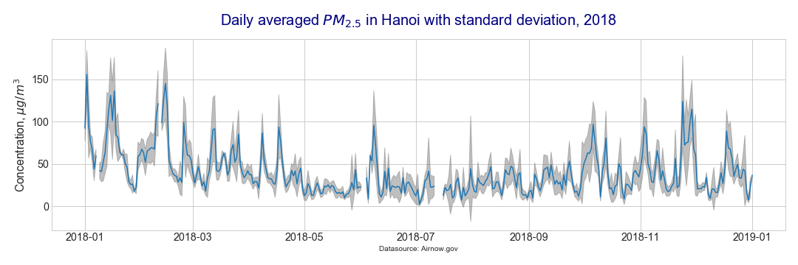
  </p>
  - pie chart with Air Quality Index (AQI) 
  <p align="center">
    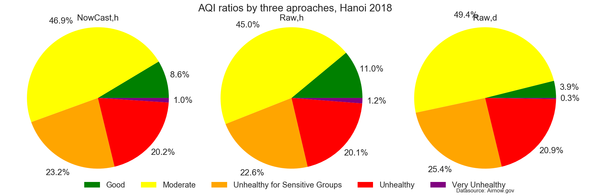
  </p>

<a id="2"></a>
## 2. Correlation of PM<sub>2.5</sub>
<a id="2.1"></a>
### 2.1 Correlation of PM<sub>2.5</sub> with time
- continue to work with the .CSV file from **AirNow.Gov** to explore the correlation between PM<sub>2.5</sub> and time such as:
  - peak-traffic hours vs. non-peak traffic hours
  - weekends vs. weekdays
  - variation of each months
- here is some graphs produced from this exercise
  <p align="center">
    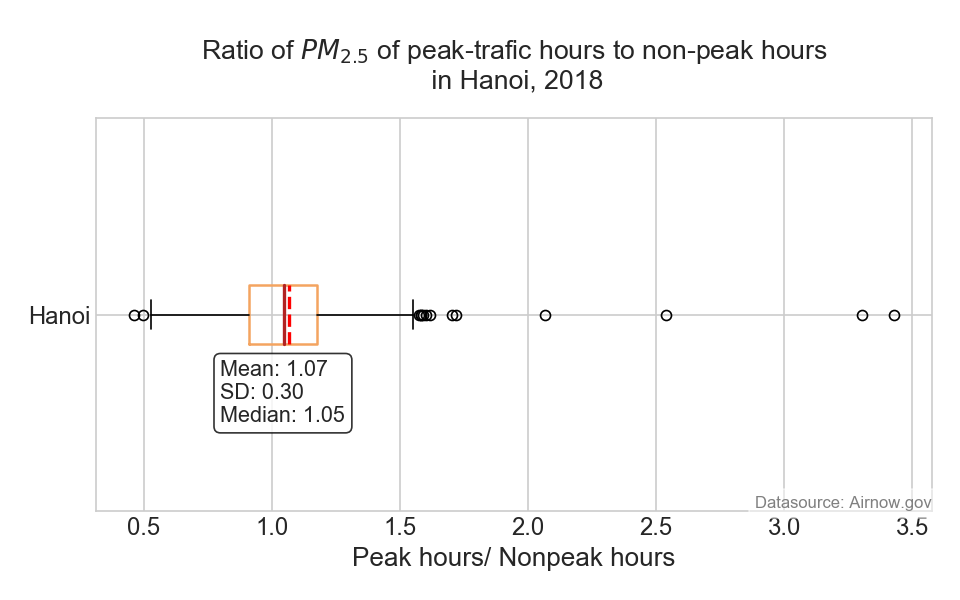
  </p>
- a summary graph of this dataset
  <p align="center">
    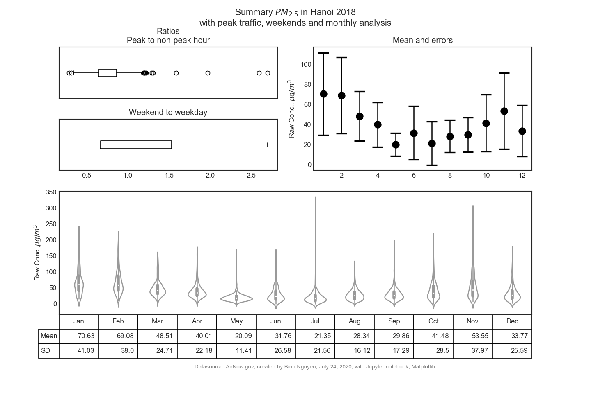
  </p>

<a id="2.2.1"></a>
### 2.2 Correlation of PM<sub>2.5</sub> with wind and temperature (data cleaning)
- explore data source (specifically working with archieved meteorologcal data from [NOAA.GOV](ncei.noaa.gov)
- clean the data (which is formatted with Integrated Surface Data (ISD) style)
- use `windrose` package to make windrose plot

  <p align="center">
    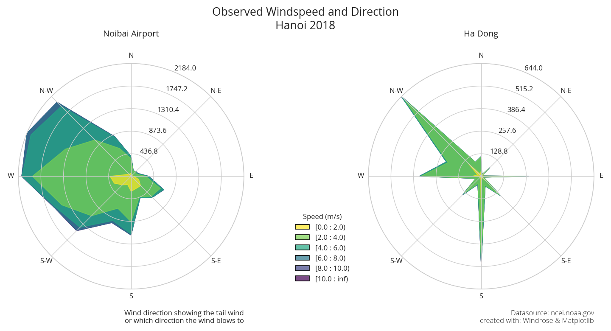
  </p>

<a id="2.2.2"></a>
### 2.2 Correlation with wind and temperature (analysis)
- explore correlation between meteorological paramters to observed PM<sub>2.5</sub> concentration such wind, temperature, height above ground
- capture espisode and examine relevant inputs with PM<sub>2.5</sub>
- some examples from this exercise
  - correlation graph:
  <p align="center">
    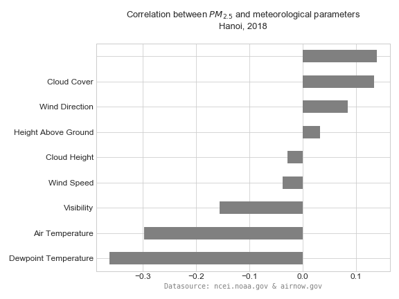
  </p>
  - what method in *that* correlation?
    <p align="center">
    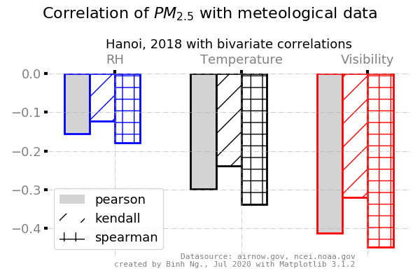
    </p>
  - a high PM<sub>2.5</sub> and a cloudy day
    <p align="center">
    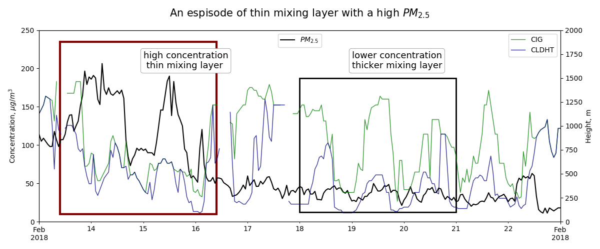
    </p>
  - or, I want to see other inputs such as.. 
  
    <p align="center">
    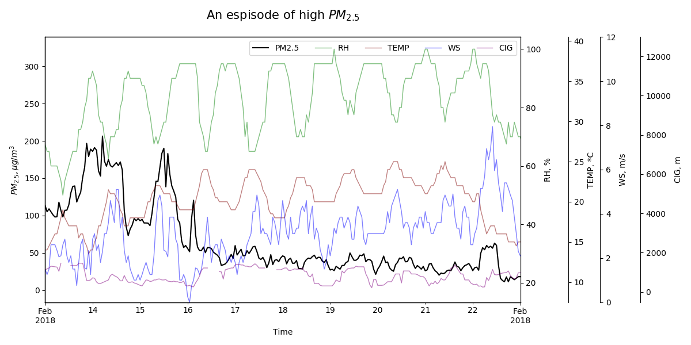
    </p>
<a id="2.3"></a>
### 2.3 Correlation with MERRA-2 data
- work with [MERRA-2](https://gmao.gsfc.nasa.gov/reanalysis/MERRA-2/) reanalysis data from NASA
- find the correlation from main groups (single level, surface turbulent flux, aerosols mixing ratio) and PM<sub>2.5</sub>
- here is the 3 summary graphs:
  - Single level diagnosis
  <p align="center">
    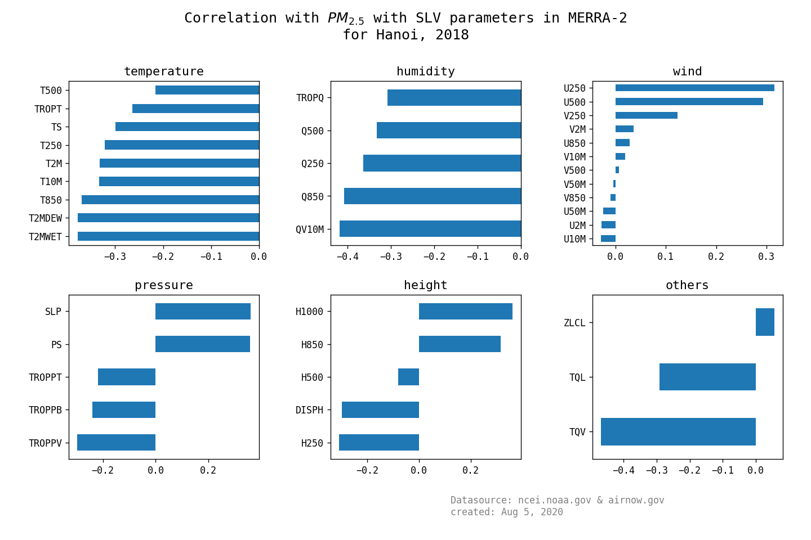
  </p>
  
  - surface turbulent flux
  <p align="center">
    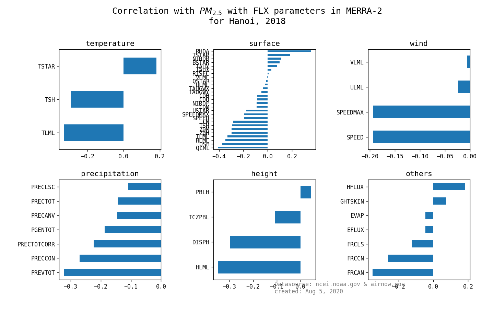
  </p>
  
  - Aerosol mixing:
  <p align="center">
    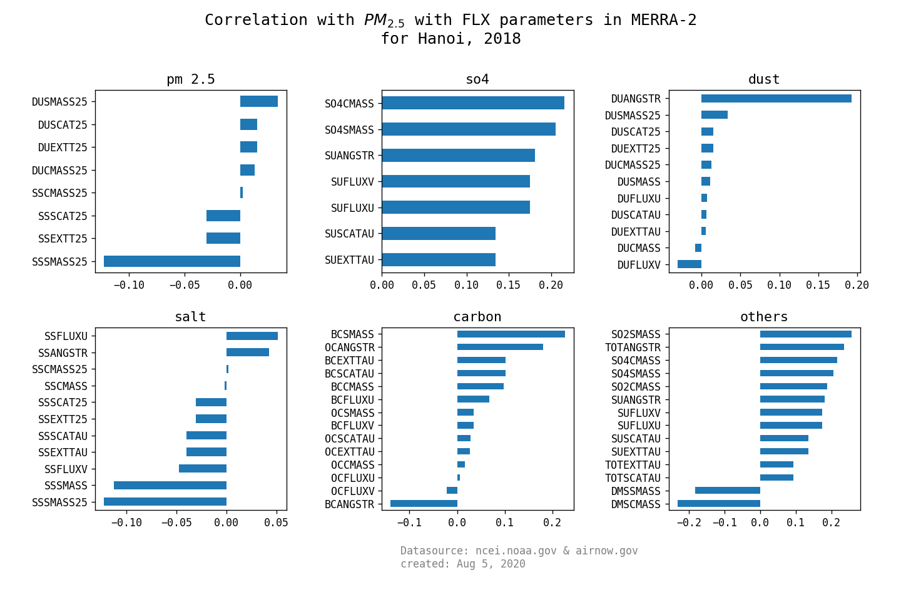
  </p>

<a id="2.4"></a>
### 2.4 Conversion wind (U,V) component, RH from temperatures
- a detour to look at conversion of wind data (U, V) vectors to speed and direction in degree
- how to use **MetPy** packages calculate such conversion instead of manually undertake
- explore data for the next which is selecting relevant data for predicting PM<sub>2.5</sub>
- some graph examples:
    - relation of height (to the ground) vs. pressure
    <p align="center">
      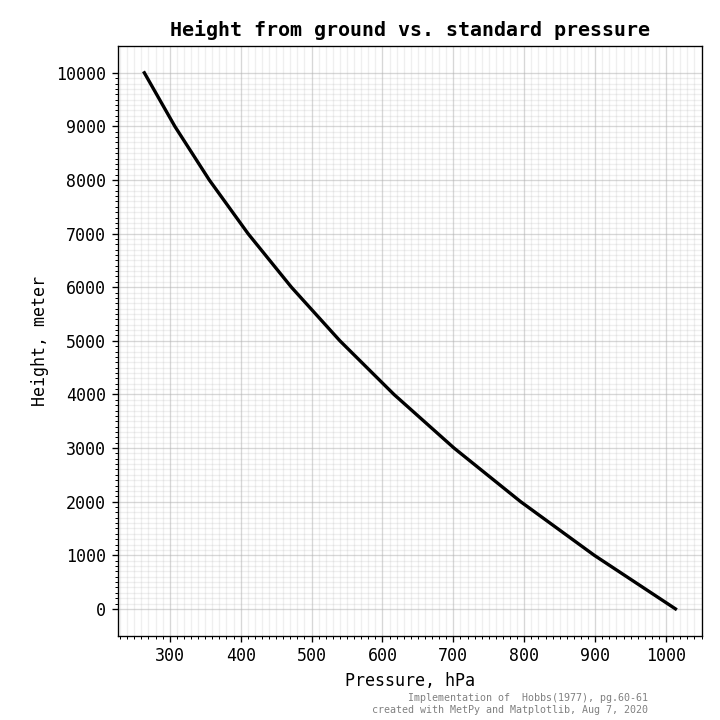
    </p>
    
    - compare values from different sources (such as from observed station, a public API, or reanalysis product)
      <p align="center">
        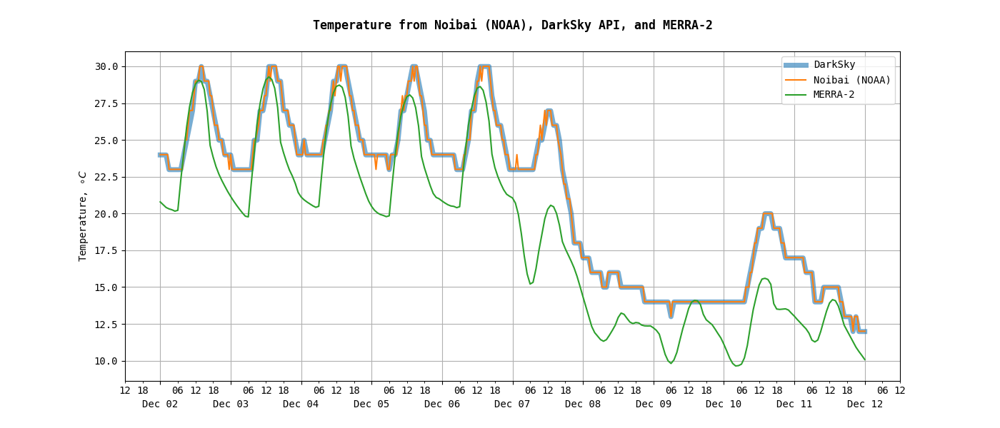
      </p>
    
    - correlation of wind speed in different altitude to PM<sub>2.5</sub> concentration
      <p align="center">
        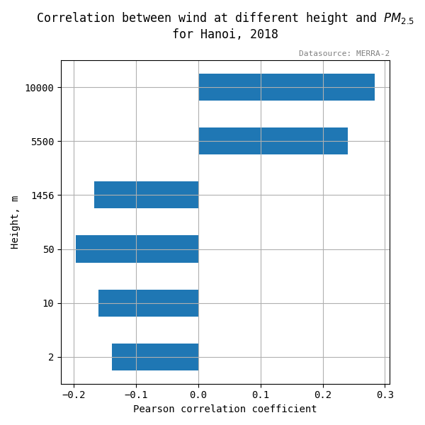
      </p>
    
<a id="3.1"></a>
### 3.1 Data selection
- combine three sources of data fromt the previous exercise
  - PM<sub>2.5</sub> from airnow.gov
  - Ground observed data from ncei.noaa.gov
  - Reanalysis data from MERRA-2 product, SLV and FLX groups (or tags)
- remove dependent data and data with weak (very weak) correlation with PM<sub>2.5</sub>
- here is outcome of this exercise:
  - preliminary heatmap (of all most input parameters, don't worry about the name just yet):
      <p align="center">
        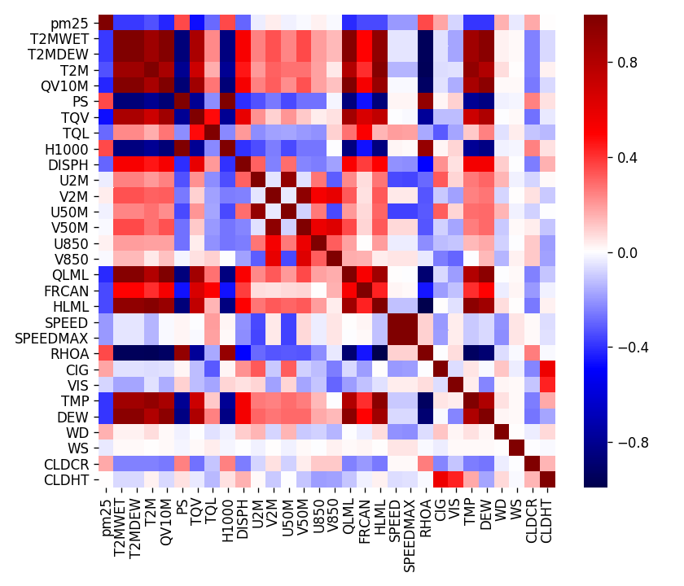
      </p>
      
  
  - a final version of selected data with correlation with PM<sub>2.5</sub>
    <p align="center">
      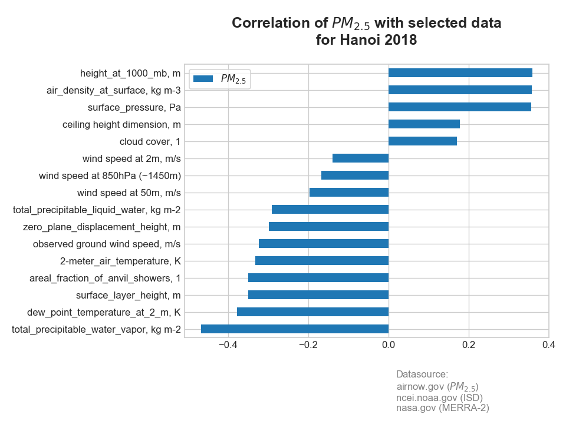
    </p>
      
  - and if you are curious about the full name of each parameter, here it is. Note that in the final version of CSV data, all temperature was converted from Kelvin (K) to Celsius (C).
   ```
   {'TQV': 'total_precipitable_water_vapor, kg m-2',
   'T2MDEW': 'dew_point_temperature_at_2_m, K',
   'HLML': 'surface_layer_height, m',
   'FRCAN': 'areal_fraction_of_anvil_showers, 1',
   'T2M': '2-meter_air_temperature, K',
   'WS': 'observed ground wind speed, m/s',
   'DISPH': 'zero_plane_displacement_height, m',
   'TQL': 'total_precipitable_liquid_water, kg m-2',
   'v_50m': 'wind speed at 50m, m/s',
   'v_850': 'wind speed at 850hPa (~1450m)',
   'v_2m': 'wind speed at 2m, m/s',
   'CLDCR': 'cloud cover, 1',
   'CIG': 'ceiling height dimension, m',
   'PS': 'surface_pressure, Pa',
   'RHOA': 'air_density_at_surface, kg m-3',
   'H1000': 'height_at_1000_mb, m'}
  ```
<a id="3.2"></a>
### 3.1 Regression
- Work with `Scikit-learn` library with regression models such Linear, DecisionTree, RandomForest
- Evaluate performance of each model and an ensamble by PM<sub>2.5</sub> and meteorological data for Hanoi, 2018. Datasets are cleaned and reduced from the previous excercise
- Apply a model with less feastures (DarkSky), but easiler to extract via API.
- Graphs from this excercise:
  - perfomance on train dataset (using ensemble regression)
    <p align="center">
      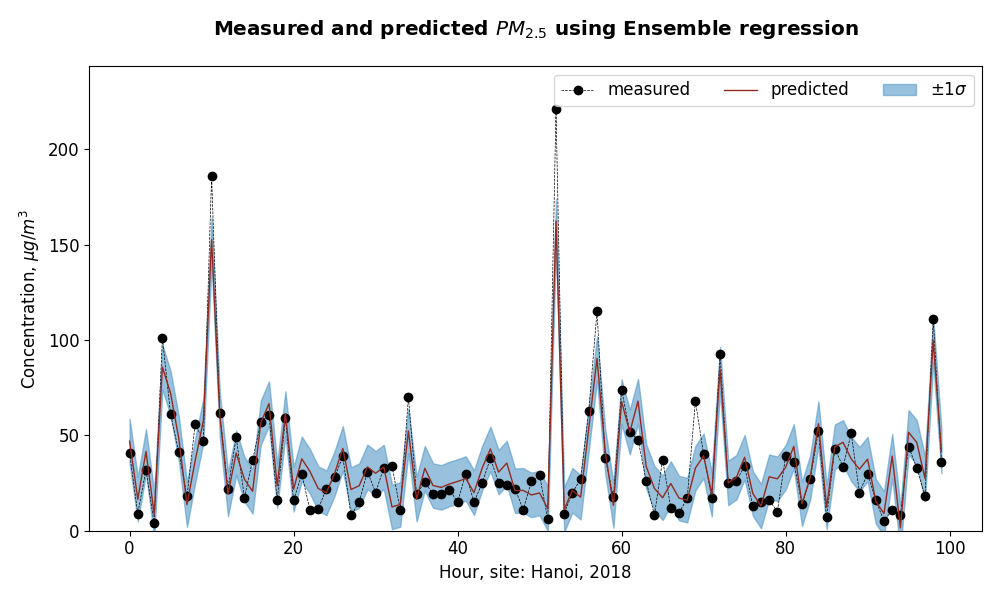
    </p>
  
  - performance on test dataset 
    <p align="center">
      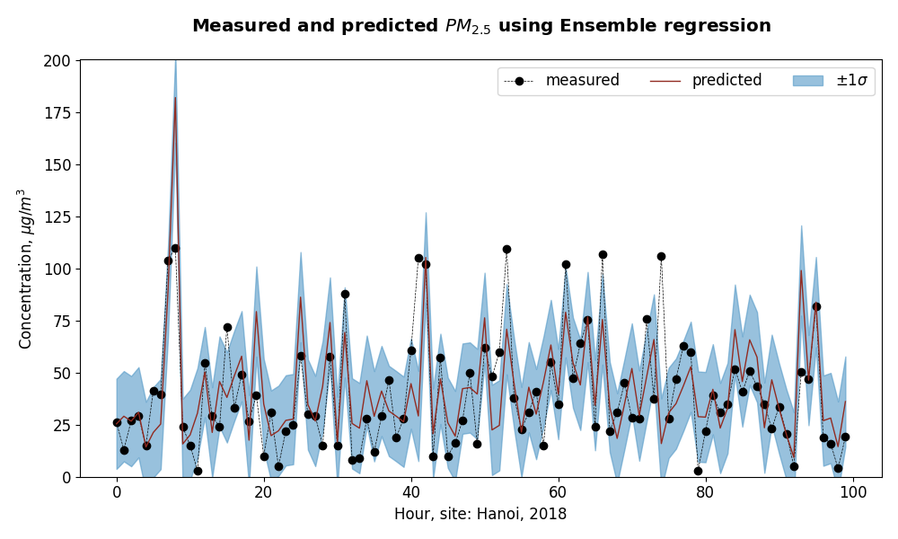
    </p>

  - relative standard deviation on each model (lower is better)
  
  <p align="center">
    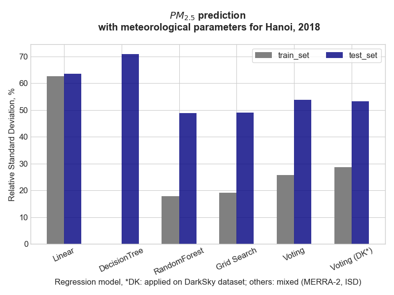
  </p>
- an hourly update web-interface using the same concept can be found here with selected sites at my personal website [b-io.info](https://b-io.info/airs/forecast/)
  - screenshot example:
  <p align="center">
    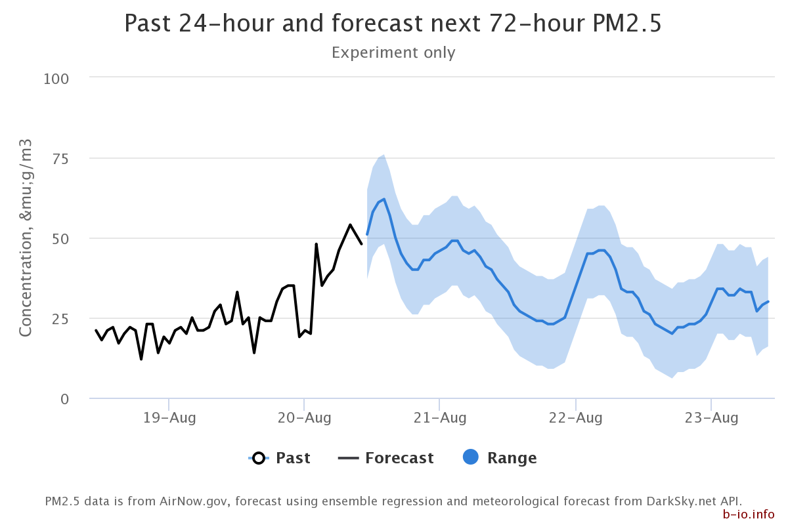
  </p>
  
<a id='tools'></a>
## tools and packages
- the analysis is carried out on Jupyter Notebook (and later with Jupyter Lab 2.2), Ubuntu 18.04LTS. 
- Python (3.6.9)
- Matplotlib (3.1.2)
- pandas (1.1.0)
- Seaborn (0.9.0)
- windrose (N/A)
- MetPy (1.0.0)
- scikit-learn (sklearn - 0.22.1)
- scipy (1.4.1)

<a id="credit"></a>
## Credits:
- some of the writing and coding are carried out while I were working with [PAM Air](pamair.org) project.  I appreciate the flexiblity from the management so that I can make this happen.
- Books: 
  - [Python for Data Analysis: Data Wrangling with Pandas, NumPy, and IPython by Wes McKinney](https://www.amazon.com/Python-Data-Analysis-Wrangling-IPython)
  - [Hands-On Machine Learning with Scikit-Learn and TensorFlow, Aurélion Géron](https://www.oreilly.com/library/view/hands-on-machine-learning/9781491962282/)
- Tutorials:
  - [Chris Albon with techniques working with dataframe](https://chrisalbon.com/python/data_wrangling/pandas_group_data_by_time/)
  - [Towards Data Science, many topics, quality varied](https://towardsdatascience.com/)

## If this work is helpful to your research
- Admittedly, citing Github repository or other open project is new, but if this work is helpful for your work, I would appreciate the attribution, a link or a word.
- To cite this work, use this `Binh Nguyen, Air Quality Analysis, GitHub repository: https://github.com/binh-bk/air-quality-analysis`

<a id="todo"></a>
# TODO
### Keras (with TensorFlow)
- experiment with LSTM is not yet promising.
